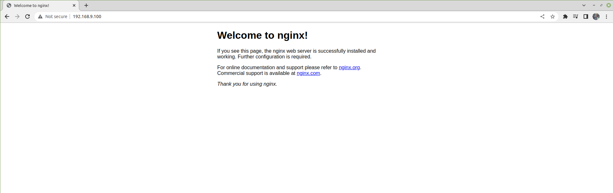
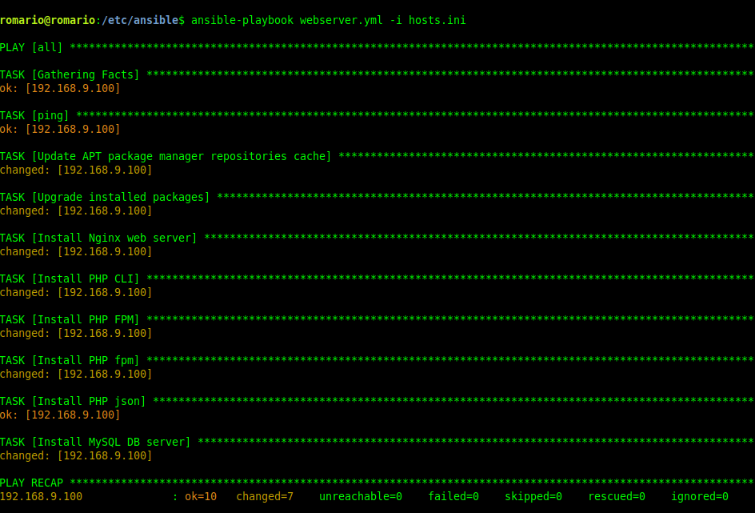

# Ansible Nginx

Ansible ini digunakan untuk mempermudah menyeting webserver dari jauh

# Usage

__Setup __
- [setuphosts.yml](hosts.yml), seluruh setup ke server dituju
- [setupwebserver.yml](webserver.yml), seluruh setup seperti NGINX,PHP, MYSQL

# TESTING

1. Untuk melakukan testing control machine maka directory ansible lakukan test hosts

### Test dari control machine
```cli
ansible-playbook -i inv-test webserver.yml
```
```cli
ansible -i hosts.ini all -m ping
```
# Book

1. https://books.evsa.my.id/book/57 
2. https://symfonycasts.com/screencast/ansible/php-ini-config
3. https://stephenreescarter.net/how-to-deploy-an-advanced-php-application-using-ansible/


# Hasil test Nginx


# Hasil install ke server



# Ansible-Nginx
